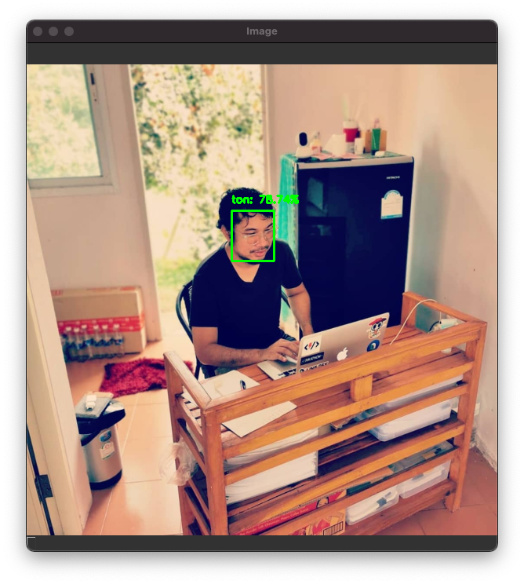

# opencv-face-recognition



```

# Capture with "k" key exit with "q" key
python3 build_face_dataset.py --cascade haarcascade_frontalface_default.xml \		--output dataset/ton

# Extract Embeddings
python3 extract_embeddings.py --dataset dataset \
        --embeddings output/embeddings.pickle \
        --detector face_detection_model \
        --embedding-model openface_nn4.small2.v1.t7

# Train
python3 train_model.py --embeddings output/embeddings.pickle \
	--recognizer output/recognizer.pickle \
	--le output/le.pickle

# Recognize faces in image
python3 recognize.py --detector face_detection_model \
	--embedding-model openface_nn4.small2.v1.t7 \
	--recognizer output/recognizer.pickle \
	--le output/le.pickle \
	--image images/ton.jpg

# Recognize faces in video
python3 recognize_video.py --detector face_detection_model \
	--embedding-model openface_nn4.small2.v1.t7 \
	--recognizer output/recognizer.pickle \
	--le output/le.pickle

```

Source: https://www.pyimagesearch.com/2018/09/24/opencv-face-recognition/